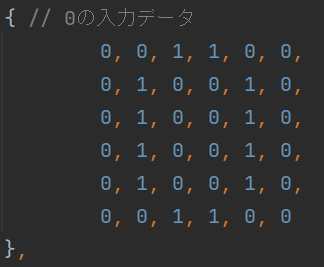

# 手書きで入力した数字を画像認識するシステム

授業の最終課題として提出したシステムです。授業内では、画像認識させたい数字を手入力で表現していました。

例）0を入力したい場合

私はこれを発展させ、**手書きで入力**できるようにしました。

プログラムを起動すると、このようなキャンバス付きのウィンドウが表示されます。

0～9の数字を手書きで入力し確定ボタンを押すと、白を0、黒を1とした10×10の配列に変換されます。

その後、コンピュータが用意していた訓練データで機会学習を行い、手書き入力した数字は何かを推測します。

